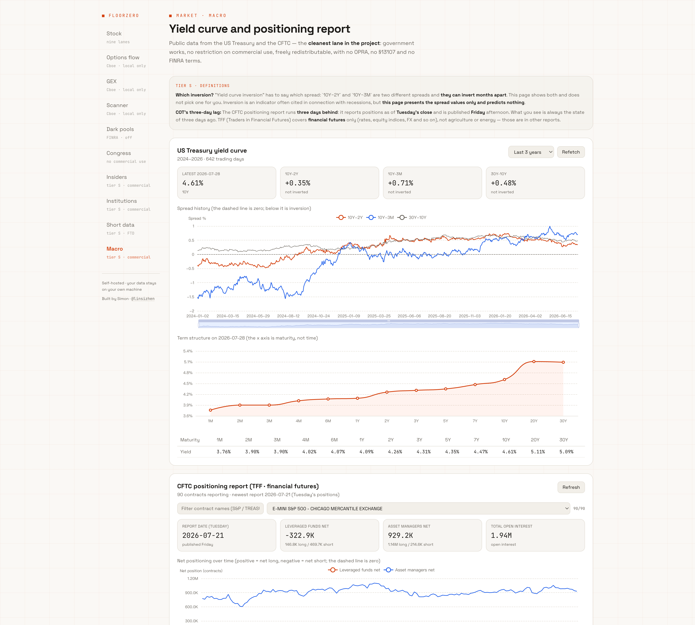
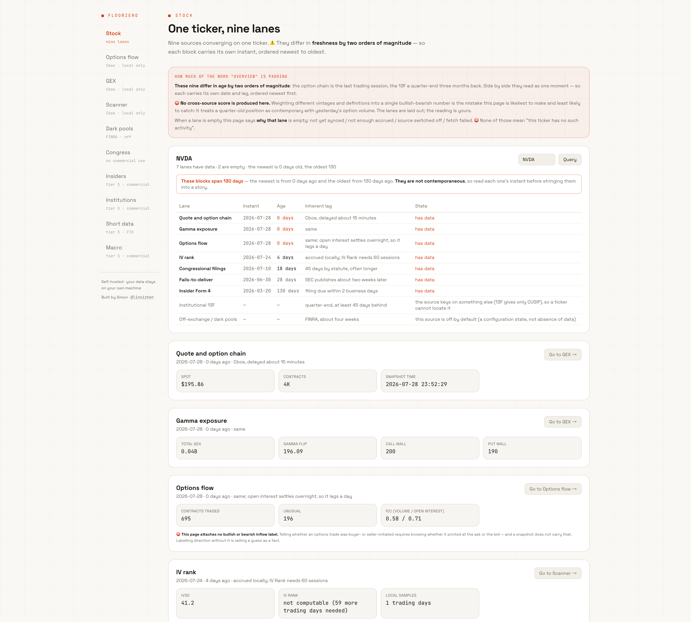
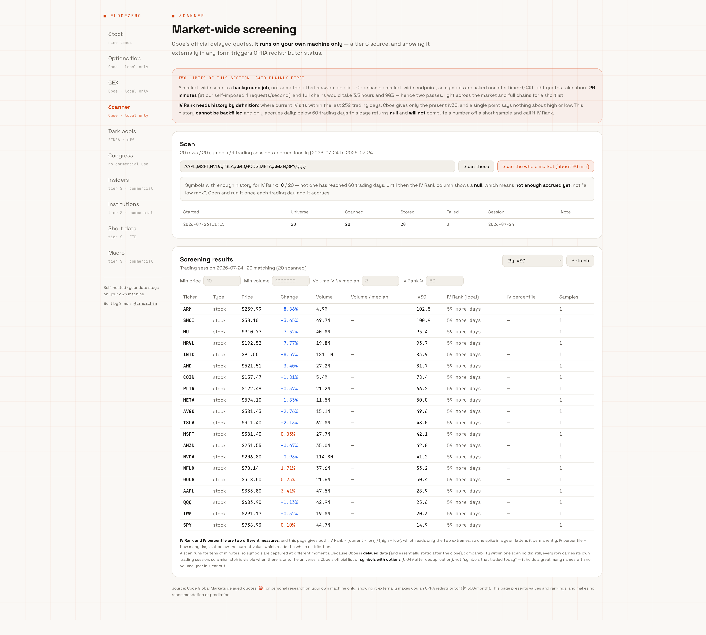

<p align="center"><a href="README.md">English</a> | <b>简体中文</b></p>

<h1 align="center">FloorZero</h1>

<p align="center">
  <b>自己的交易大厅。十个分栏，零托管数据。</b><br>
  期权流 · GEX · 扫描器 · 暗池 · 国会交易 · 内部人 · 13F · 做空数据 · 宏观 · MCP
</p>

<p align="center">
  
  
  
  
  
</p>

<p align="center">
  <a href="#这是什么">这是什么</a> ·
  <a href="#为什么必须你自己跑">为什么必须你自己跑</a> ·
  <a href="#快速开始">快速开始</a> ·
  <a href="#十个分栏">十个分栏</a> ·
  <a href="#路线图">路线图</a> ·
  <a href="#数据源与它们的条款">数据源与条款</a> ·
  <a href="#它刻意不做的事">它刻意不做的事</a> ·
  <a href="#mcp">MCP</a> ·
  <a href="CHANGELOG.md">更新日志</a>
</p>

---

## 截图

没有 demo 站 —— 那个约束正是这个项目的立意所在 —— 所以在真跑起来之前，
这是唯一能看到它长什么样的方式。截图是软件的示意，不是数据服务。

**宏观** —— 财政部与 CFTC，全项目唯一一条完全没有许可约束的线。
两条倒挂口径并排显示，因为它们穿越零轴的时点能差好几个月，
不说清用的哪一条，"曲线倒挂了"这句话就没有意义。



**个股** —— 九条线在一只票上，按各自有多旧排序。
横幅报的是最新与最旧相差多少天，图里是 126 天。
两条线是空的，而它们各自说明了自己为什么空，而不是留一片空白。



**扫描器** —— IV Rank 那一列从头到尾写着"还差 59 天"，
因为它需要的历史补不回来、而当时还没攒够。
那一列就是这个项目的全部主张浓缩成的一张图：
**一个算不出来的指标，诚实的输出不是一个数字。**



## 这是什么

一个本地跑的市场数据工作台，覆盖范围大致相当于付费期权流服务，
但完全建立在免费公开源上。你 clone、你运行，数据落在你自己的硬盘。

它**不是**数据服务、不是 SaaS、不是在线看板。没有 demo 站，以后也不会有 ——
下面会说清为什么这是设计约束而不是偷懒。

面向的是想自己做分析、自己造工具、或者把数据喂给大模型的人。
它不是"打开就看盘"的 App —— 那是券商的活，免费而且更好。

## 为什么必须你自己跑

塑造整个项目的那一个决定：**我们只分发代码，绝不托管数据。**

Cboe 的延时期权数据属于 OPRA。OPRA 的规则很直白 ——
*只要你在 app、工具或网站里对外展示 OPRA 数据，你就是 redistributor* ——
那是 **每月 $1,500**，且**免费、开源、非商业一律不豁免**。

做一个在线看板，这笔钱就得交。分发代码让每个用户自己跑，
每个用户就都是在做个人研究。所以：

- 后端默认只监听 `127.0.0.1`。
- 永远不做 demo 站。推广只能靠截图和 README。
- 每个源的合规级直接标在侧栏上，不藏在脚注里。

## 快速开始

```bash
git clone <本仓库> && cd floorzero

# 后端
cd backend
pip install -r requirements.txt
cp ../.env.example ../.env        # 然后填 FZ_CONTACT，见下
FZ_CONTACT="你的名字 you@example.com" python -m uvicorn app:app --host 127.0.0.1 --port 8920

# 前端（另开一个终端）
cd frontend && npm install && npm run dev
```

`FZ_CONTACT` **必填且没有默认值**。SEC 与国会披露站点要求 User-Agent 带上
可识别调用方的联系方式。与其内置一个占位值 —— 那会让你在毫不知情的情况下被限流 ——
程序选择在你没配之前**直接拒绝启动**。它只是让那些站点认得**你自己**，不会发往任何第三方。

需要 Python 3.9 或更新（`zoneinfo`）；启动闸会检查并给出人话提示。

## 十个分栏

| 分栏 | 内容 | 源 |
|---|---|---|
| **个股** | 一只票在其余九条线上的画像，**每块标注自己的时点** | 全部 |
| **期权流** | vol/OI 异动、三口径认沽认购比、绝对 delta 敞口、本地持仓量沉淀 | Cboe |
| **GEX 伽马** | 伽马敞口、flip、call/put wall、vanna 与 charm、到期 × 行权价曲面 | Cboe |
| **扫描器** | 全市场按 IV Rank、量比、价格筛选 | Cboe |
| **暗池** | ATS 场所与非 ATS 内部化，**始终分开** | FINRA |
| **国会交易** | 众议院与参议院 PTR 申报、披露延迟 | 两院 |
| **内部人** | Form 4，公开市场交易与薪酬类分开 | SEC EDGAR |
| **机构持仓** | 13F 持仓与季度环比 | SEC EDGAR |
| **做空数据** | SEC 交割失败；FINRA 场外空头量可选 | SEC / FINRA |
| **宏观** | 美债收益率曲线（两条倒挂口径）、CFTC 持仓 | 财政部 / CFTC |

## 路线图

**当前是 0.1.0 —— 一个能用的起点，不是成品。** 十个分栏今天就能跑；
版本号负责说明"做到哪一步了"。**每加一个分栏，次版本号 +1**，
而 **1.0 才是完全版**。

| 版本 | 新增 | 为什么还没有 |
|---|---|---|
| **0.1** ✅ | 个股 · 期权流 · GEX · 扫描器 · 暗池 · 国会 · 内部人 · 机构 · 做空 · 宏观 | — |
| 0.2 | **波动率** —— IV 期限结构、偏斜、方差风险溢价 | 依赖扫描器还在沉淀的本地 IV 历史；不满 60 个交易日，分位就没有意义 |
| 0.3 | **财报与基本面** —— 三表、财报日历、超预期历史 | EDGAR XBRL 与已接好的申报索引不是同一种结构 |
| 0.4 | **板块与市场潮汐** —— 分板块净流入、市场宽度 | 单只票很便宜，全市场很贵；要先有扫描器的批量通道 |
| 0.5 | **季节性** —— 按月、按年 | 要的是好几年的本地历史，不是一次取数 |
| 0.6 | **预测市场** —— Polymarket 与 Kalshi 作宏观叠加层 | 在别处已经跑通，是移植不是发明 |
| … | | |
| **1.0** | 完全版 | |

**不在这张表上的，就是没有计划。** 这是刻意的，和原因码是同一个承诺：
**把做不到的事说清楚。**

⚠️ **故意不写日期。** 这是一个人的业余项目，
带日期的路线图会是这份 README 里第一个变成假话的东西。

## 数据源与它们的条款

每个源都带一个合规级，直接显示在对应分栏旁边：

| 级 | 源 | 商用 | 再分发 |
|---|---|---|---|
| **S** | SEC EDGAR · 财政部 · CFTC | ✅ | ✅ |
| **S−** | 国会两院财产申报 | ❌ **法律明文禁止** | ✅（公开记录）|
| **B** | FINRA（Reg SHO / ATS）| ❌ 仅限非商业 | ❌ |
| **C** | Cboe | ❌ 需授权 | ❌ |

其中两条值得单独一段。

**国会申报虽是公开记录，但 5 U.S.C. §13107(c)(1)(B) 明文规定
「为任何商业目的获取或使用这些报告均属违法」**（新闻媒体面向公众传播除外），
罚款上限 $10,000。免费、开源、自部署做个人研究没问题；
**任何收费产品或商业服务都不得包含这条线**。
这与 EDGAR **不是**一回事 —— EDGAR 只限请求速率与 User-Agent，不限商用。

**FINRA 默认关闭**（`FZ_ENABLE_FINRA=1` 才启用）。其 Terms of Use 限
「**仅供你自己的非商业个人或专业用途**」，且限制 (d) 明文禁止
「**用 FINRA 网站的数据建立数据库**」—— 而"下载→落 SQLite"正是这个动作。
其中确有模糊之处（条款写的是 FINRA.**org**，而数据文件在 `cdn.finra.org`）。
**我们不替你解释这些条款**：原文原样摆在界面上，开关在你手里。
任何分栏都不以 FINRA 作为唯一数据源。

## 它刻意不做的事

这几条是刻意的，而且是承重的。

**不给期权流任何方向标签。** 判断一笔成交是买方还是卖方发起，
必须知道它打在 ask 还是 bid，那需要逐笔成交带，而那需要 OPRA。
免费接口给的是链的**快照**：当日累计成交量、持仓量、报价、希腊字母。
所以 sweep 检测、大单分级、主动买卖方向、开仓平仓判定**全都做不了** ——
这一栏把这句话放在最前面，而不是猜一个。

**算不出来的地方不给数字。** IV Rank 需要一年历史，而 Cboe 只给当下 ——
所以攒够 60 个交易日之前，这个字段是空的、并告诉你还差几天，
**绝不**拿 20 天的样本硬算一个：那个数看着一样专业，衡量的却是另一回事。
这条贯穿全项目：缺失的希腊字母、没有的报价、没扫到的交易日、到期消失的合约，
一律显示为"算不出 + 原因"，而不是 0。

**不做跨源综合评分。** 个股页上九条线的新鲜度相差两个数量级 ——
实测 NVDA：期权链 2 天前，最近一笔 Form 4 是 128 天前。
压成一个"多空分数"，等于把三个月前的持仓和昨天的期权成交当成同一件事。

**其实是一个结论都不给。** 输出的是数据和算术。
没有买卖标签、没有目标位、没有预测。

## 有些历史只能自己攒

有两份数据补不回来，因为 Cboe 只给当下：

- **逐合约持仓量** —— 它的日间变化是"有人在建仓"最干净的证据，
  而且**不需要猜方向**（不像 tape 那套）。
- **逐标的 iv30** —— 没有它就没有 IV Rank。

两者从你装上那天开始积累，跑得越久越值钱。
EDGAR 与 FINRA 那几条线自带历史，随时可以回补。

## MCP

十七个工具，**只在 `backend/tools.py` 定义一次**，MCP server 自动继承 ——
所以 REST 与 MCP 不可能各说各话。任意 MCP 客户端指向 `backend/mcp_server.py` 即可。

工具的返回摘要带着与界面**同样的**告诫 ——
助手来问期权流，响应里就会告诉它：这份数据推断不出方向。

## 测试

```bash
cd backend
pip install -r requirements-dev.txt
python -m pytest
```

52 个用例，**一个都不打网络**。测的是算术与语义 ——
也就是当初被对抗式审计反复抓出来的那些不变量：

- **算不出来的东西不能渲染成 0**，且覆盖它当初出现过的每一种形状
  （某一边的希腊字母全缺、没有报价、分母为零、成交量中位数为零、利差缺一条腿）
- **"为什么空"要传到调用方** —— `iv_rank` 有三种成因为空，只有一种是"再等几天"
- **本地历史按交易时段归档**，所以同一份周五收盘不会变成"两天的观测"；
  IV 历史按目标时段截断，所以查过去某天不会借用未来的数据
- **到期不是平仓**，抓取不完整时缺席的合约也不是"持仓归零"
- **聚合行与明细行绝不相加**（加了正好翻倍）
- **一条线挂掉不带倒整页**

这套测试**自己也被同样审了一遍**，查出四个**假阳性**用例 ——
即被测代码改坏了它们照样绿：

- "按墙上日期归档"抓不住，因为测试里两次调用本来就在同一天
- "缺 session 被丢弃"只看了函数自己返回的计数，没查库
- "整段替换"是拿同一个模块产出的汇总字段去验它自己
- "只有 no_data 才表示没有"靠的是**在文案里找"没有"两个字**

四个现在都改成断言**库里的实际行**，或断言代码导出的常量
（`MEANS_ABSENT` —— UI 与 MCP 层也读同一个，而不是各自去猜）。

两轮合计做了**十次变异测试**（刻意改坏十处不变量），**十次全被抓住**。

测试走一次性的 `FZ_DATA_DIR`，而且 fixture 在放行前会**先断言解析后的库路径
确实落在临时目录里**。这道闸不是仪式：`db.py` 哪天不再认那个变量，
测试就会一声不响地写进补不回来的历史。

## 架构

```
backend/sources/    cboe · edgar · edgar13f · congress · shorts · darkpool · macro · contact
backend/modules/    greeks · bs · flow · scanner · darkpool · insider · institution ·
                    congress · shorts · market · stock · history · *_store · *_sync
backend/            app.py(FastAPI) · tools.py(工具唯一定义处) · mcp_server.py
frontend/src/pages  十个分栏
docs/               模块设计.md（架构） · 开发日志.md（逐栏建造记录）
```

Python 3.9+ · FastAPI · React 19 · Vite · Tailwind · ECharts · SQLite。
后端只有四个依赖。数据存在 `~/.floorzero/`、在仓库之外 ——
更新代码永远不会弄丢你攒下的历史。

## 更新日志

见 [CHANGELOG.md](CHANGELOG.md)。

## 免责声明

本软件呈现的是公开可得的数据，以及基于这些数据的算术。
它不是投资建议，作者也不是持牌投资顾问。
每个数据源都有自己的边界 —— 滞后、修订、口径怪癖 —— 软件已尽力把它们说清楚，
但你要为自己得出的结论负责，也要为在你所在法域与使用场景下遵守各数据源的条款负责。

## 赞赏

<p align="center">
  <a href="https://buymeacoffee.com/simonlin1212"></a>
</p>

## License

MIT — 见 [LICENSE](LICENSE)。

**作者：** Simon 林 · X [@linsizhen](https://x.com/linsizhen) · 邮箱：[simonlin0423@gmail.com](mailto:simonlin0423@gmail.com)
